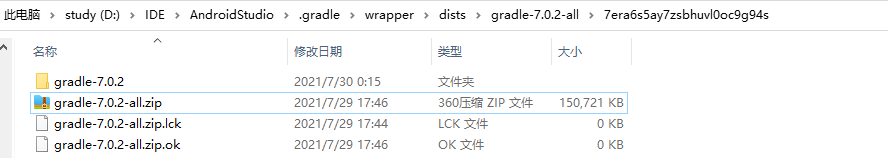
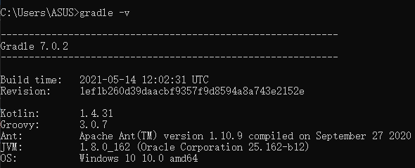
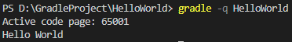
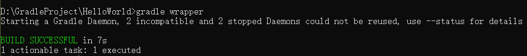

# Gradle学习笔记(1)

`Gradle`是构建`Android`应用的工具，理解其中的工作原理对于`Android`开发有一定的辅助作用。本文将记录自己学习`Gradle`的过程，作为以后复习的笔记。`Gradle`学习笔记的第一部分将介绍`Gradle`的基础知识，包括环境搭建、`Gradle Wrapper`、常用命令、日志等。

## 环境搭建

本文直接使用Android中的`gradle`环境，具体环境配置如下：

1. 找到Android Studio中`.gradle`的目录路径，目录路径如图所示。
   

2. 找到对应版本的`gradle`目录,具体在`.gradle`目录下的`wrapper\dists\gradle-*.*.*-all\*\`中。
   

3. 将`gradle-*.*.*`目录拷贝到gradle需要安装的位置，配置环境变量，将`gradle-*.*.*`目录中的`bin`目录添加到Path中。

4. 测试。在控制台输入`gradle -v`，控制台会输出gradle的版本信息。
   

## 开发环境

学习`gradle`的开发环境直接使用VS Code(也可以啥都不用，这个不重要)，编写测试代码`HelloWorld`。

1. 新建文件夹`HelloWorld`，新建文件`build.gradle`,编写代码：

   ``` groovy
   task HelloWorld{
      doLast{
         println "Hello World"
      }
   }
   ```
2. 在终端输入命令`gradle -q HelloWorld`。
   

> 代码说明：
>
> 1. `build.gradle`是`Gradle`默认的构建脚本文件，执行`Gradle`命令的时候，会默认加载当前目录下的`build.gradle`文件，可以通过`-b`参数指定要加载执行的文件。
>
> 2. 此代码定义了一个名为HelloWorld的任务（即`task`）,任务中包含一个`Action`(即`doLast`,本质上是一次代码回调，`task`执行结束后会回调doLast这部分闭包的代码)
>
> 3. `gradle -q HelloWord`表示要执行`build.gradle`脚本中名为`HelloWord`的`task`，`-q`参数用于控制`gradle`输出的日志级别，以及哪些日志可以输出被看到。`q`对应`QUIET`，此外还有`-d`（`DEBUG`级别），`-i`（`INFO`级别）等。
>
> 4. `println "Hello World"`是`System.out.println("Hello World")`的缩写。`groovy`将`println`方法添加进`Object`中,而且在`groovy`中，方法调用可以省略括号，空格分开即可。最后，单引号和双引号在`groovy`中均表示字符串。

## Gradle Wrapper

`Gradle Wrapper`是对`gradle`进行的一层包装，目的是在团队开发中使用统一版本的gradle进行构建，避免版本不一致而产生的问题。

### 生成wrapper

在项目的根目录下（即`build.gradle`所在的目录）执行`gradle wrapper`命令即可生成`wrapper`。



此外，`gradle wrapper`可以已添加一些参数进行配置。例如`gradle wrapper --gradle-version 7.1`可将`wrapper`的版本设置成`7.1`。常见配置选项如下：

|参数名|说明|
|:--:|:--:|
|`--gradle-version`|指定使用的`gradle`版本|
|`--gradle-distribution-url`|指定下载`Gradle`发行版本的`url`地址|

执行完`gradle wrapper`命令后，根目录下会生成`gradlew`、`gradlew.bat`两个文件和`gradle`目录。`gradle`目录下仅有一个`wrapper`目录，`wrapper`目录中包含`gradle-wrapper.jar`和`gradle-wrapper.properties`两个文件。目录结构如下所示：


`ps`:`.gradle`目录是运行`gradle`命令后自动生成的，不用管

`gradlew`是用于linux下的脚本，`gradlew.bat`是用于`windows`下的脚本。两个脚本的用法和`gradle`命令基本一样。
`gradle-wrapper.jar`是具体业务逻辑实现的`jar`包，`gradlew`最终是使用`Java`执行这个`jar`包来进行相关的`gradle`操作
`gradle-wrapper.properties`是`gradle wrapper`的配置文件,默认生成的配置文件内容如下。

``` properties
distributionBase=GRADLE_USER_HOME
distributionPath=wrapper/dists
distributionUrl=https\://services.gradle.org/distributions/gradle-7.0.2-bin.zip
zipStoreBase=GRADLE_USER_HOME
zipStorePath=wrapper/dists
```

`properties`各字段的说明如下：

|字段名|说明|
|:--:|:--:|
|`distributionBase`|下载的`Gradle`压缩包解压后存储的主目录|
|`distributionPath`|相对于`distributionBase`的解压后的`Gradle`压缩包的路径|
|`zipStoreBase`|同`distributionBase`，但是存的是`zip`压缩包|
|`zipStorePath`|同`distributionPath`，但是存的是`zip`压缩包|
|`distributionUrl`|`Gradle`发行压缩包的下载地址|

如果运行gradlew命令时，计算机卡住不动，可以更换`distributionUrl`，使用镜像下载。

此外，`wrapper`通过`gradle`中的`task`生成，因此我们也可以通过自定义的`task`生成`wrapper`，而且在自定义的`task`中对`gradle-wrapper.properties`进行配置。示例代码如下：

   ``` groovy
      task myWrapper(type: Wrapper){
         gradleVersion = "7.0.2"
         distributionUrl = "https://services.gradle.org/distributions/gradle-7.0.2-bin.zip"
      }
   ```

执行`gradle -q MyWrapper`，会得到与`gradle wrapper`相同结果。

最后，`gradlew`使用示例如下：


## Gradle日志

`gradle`的日志等级如下：

|等级|说明|
|:--:|:--:|
|`error`|错误|
|`quiet`|重要|
|`warning`|警告|
|`lifecycle`|进度|
|`info`|信息|
|`debug`|调试|

使用方法如下：

   ``` groovy
      //输出warning以上级别的日志
      gradle -w taskName

      //输出info以上级别的日志
      gradle -i taskName
   ```

堆栈信息默认关闭，使用`gradle -s taskName`可以输出堆栈信息。

使用`println 'information'`可以打印`quiet`级别的日志（默认设置），也可以使用内置的`logger`打印其他级别的日志。例如：

   ``` java
   logger.quiet("quiet级别日志")
   logger.error("error级别日志")
   logger.warn("warn级别日志")
   logger.lifecycle("lifecycle级别日志")
   logger.info("info级别日志")
   logger.debug("debug级别日志")
   ```

## Gradle常用命令

``` groovy
// 查看帮助
./gradlew -?
./gradlew -h
./gradlew -help

// 查看可执行的任务
./gradlew tasks

// 强制刷新依赖
./gradlew --refresh-dependencies assemble

// 多任务调用
./gradlew task1 task2 task3

// 缩写，例如：./gradlew helloWorld可以写为
./gradlew hh
//但是实验测试失败！！！

```


