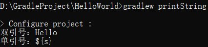
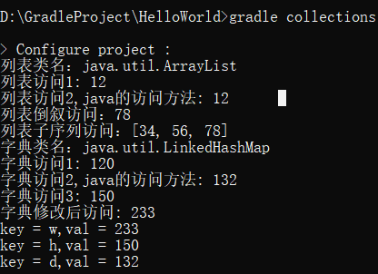
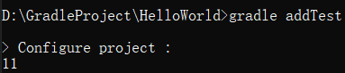
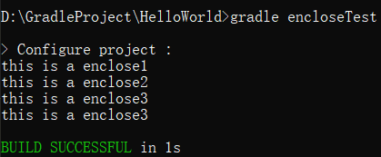
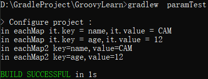
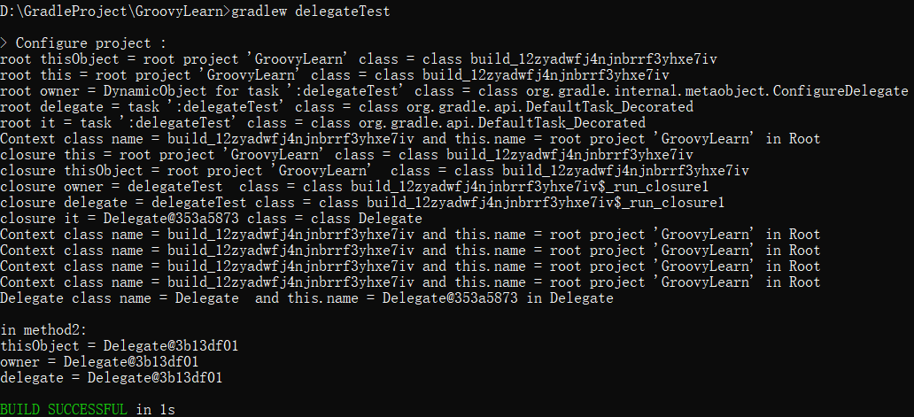

# Gradle学习笔记(2)

`Gradle`学习笔记的第二部分将介绍`Groovy`的基础。`Gradle`是`Groovy`编写的DSL（领域特定语言），因此每一个`Gradle`的`build`脚本都是一个`Groovy`脚本文件。`Groovy`是基于JVM的动态语言，完全兼容`Java`，因此可以在Gradle文件中编写任意符合规范的`Groovy`代码和`Java`代码。

## 语言特性

1. Groovy中，每条语句的末尾不需要加分号`;`

## 字符串

双引号和单引号都能表示字符串，但是单引号表示的是存粹的字符串常量，不能参与字符串的表达式运算，示例如下：

``` groovy
    task printString{
        String s = "Hello"
        println "双引号：${s}"
        println '单引号：${s}' 
    }
```

执行结果如下：



可以看出，`println '单引号：${s}'`并没有对`${}`表达式进行运算

## 集合

`Groovy`对`Java`集合进行了扩展，但是感觉直接用`Java`的集合会更方便。

``` groovy
    // 列表
    
    task collections{
        // 列表List
        def list = ["12",'34',"56","78"]
        println "列表类名：${list.getClass().name}"
        println "列表访问1: ${list[0]}"
        println "列表访问2,java的访问方法: ${list.get(0)}"
        println "列表倒叙访问：${list[-1]}" //像python一样倒序f访问
        println "列表子序列访问：${list[1..3]}" //

        // 字典Map，Hash表
        def map = ["w":120,"h":150]
        map['d'] = 132 //添加元素
        println "字典类名：${map.getClass().name}"
        println "字典访问1: ${map["w"]}"
        println "字典访问2,java的访问方法: ${map.get("d")}"
        println "字典访问3: ${map.h}"

        map['w'] = 236 //修改value1
        map.put('w',233) //修改value2
        println "字典修改后访问: ${map["w"]}"
        //foreach便利
        map.each{
            // 当闭包中只有一个参数时，可以用it代替
            println "key = ${it.key},val = ${it.value}"
        }
    }
```

执行结果如下：


## 方法

`Groovy`中方法定义为：
`def methodName(type1 param1,type2 param2){}`
方法的返回类型可以省略。

Groovy中方法的调用为：
`methodName(param1,param2)`
与`Java`相同,但是括号可以省略，即：
`methodName param1,param2`
如果需要接收方法返回的结果，则：
`def result = methodName param1,param2`

示例代码如下：

``` groovy
    def add(int x,int y){
        x + y
    }
    task addTest{
        def x = add(5,6)
        println x
    }
```

运行结果如下：


### 闭包

`Groovy`中，被花括号包裹的代码块即为闭包。方法是可以接收闭包作为参数的（和`kotlin`中的`lambda`表达式类似）。

示例代码：

``` groovy
    def encloseFun(Closure  e){
        e.call()
    }
    task encloseTest{
        // 常规写法
        def c1 = {
            println "this is a enclose1"
        }
        encloseFun(c1)

        // 可以省略闭包的定义
        encloseFun({
            println "this is a enclose2"
        })

        //方法的最后一个参数是闭包，则可以将闭包写在括号外面
        encloseFun(){
            println "this is a enclose3"
        }

        //方法可以省略括号，变成gradle中的常见形式。事实上，gradle中的各种写法都是在进行方法调用
    }
```



闭包是可以接收参数的，当闭包只有1个参数时，可以省略，并在代码块中用it代替，当参数大于2时，要全部写出。示例代码如下：

``` groovy
    task paramTest{
        // eachMap的方法参数是一个闭包，这个闭包需要1个参数,用默认的it代替
        eachMap{
            println "in eachMap it.key = $it.key,it.value = $it.value"
        }
        // eachMap2的方法参数是一个闭包，这个闭包需要两个参数
        eachMap2{ k,v->
            println "in eachMap2 key=$k,value=$v"
        }
    }

    def eachMap(Closure closure){
        def map = ["name":"CAM","age":12]
        map.each{
            closure(it)
        }
    }

    // 定义方法的参数可以省略
    def eachMap2(closure){
        def map = ["name":"CAM","age":12]
        map.each{
            closure(it.key,it.value)
        }
    }
```

运行结果如下：


闭包中最重要的内容时是委托，它也是`Gradle`配置项目时常用的技术。闭包内部包含了3个属性：`thisObject`、`owner`、`delegate`。在闭包中可以直接调用这三个属性的方法，不需要指明方法的对象。闭包会依次从`thisObject`、`owner`、`delegate`属性中查找方法，一旦找到就开始执行。即闭包内方法的处理顺序：`thisObject`>`owner`>`delegate`。示例代码如下：

``` groovy
    task delegateTest{
        // root thisObject = root project 'GroovyLearn' class = class build_12zyadwfj4njnbrrf3yhxe7iv
        println "root thisObject = ${thisObject} class = ${thisObject.getClass()}"
        // root this = root project 'GroovyLearn' class = class build_12zyadwfj4njnbrrf3yhxe7iv
        println "root this = ${this} class = ${this.getClass()}"
        /*thisObject和this等价，返回闭包定义处所处的类*/

        //root owner = DynamicObject for task ':delegateTest' class = class org.gradle.internal.metaobject.ConfigureDelegate
        println "root owner = ${owner} class = ${owner.getClass()}"
        /*owner返回它最直接的封闭的对象,可以是一个闭包也可以是一个类*/

        // root delegate = task ':delegateTest' class = class org.gradle.api.DefaultTask_Decorated
        println "root delegate = ${delegate} class = ${delegate.getClass()}"
        /*delegate默认和owner等价,但是可以被修改为任意对象*/

        // root it = task ':delegateTest' class = class org.gradle.api.DefaultTask_Decorated
        println "root it = ${it} class = ${it.getClass()}"//task这个闭包的it,和delegate等价，说明delegate被修改了，这是gradle的常用套路
        //Context class name = build_12zyadwfj4njnbrrf3yhxe7iv and this.name = root project 'GroovyLearn' in Root
        method1()
        //默认调用thisObject的method1，因为它的优先级最高,而且delegate和owner没有method1方法
        
        // 这行代码会报错：Could not find method method1() for arguments [] on task ':delegateTest' of type org.gradle.api.DefaultTask.
        // delegate.method1()//因为delegate没有method1方法


        new Delegate().test{
            // closure this = root project 'GroovyLearn' class = class build_12zyadwfj4njnbrrf3yhxe7iv
            println "closure this = ${this} class = ${this.getClass()}"
            //closure thisObject = root project 'GroovyLearn'  class = class build_12zyadwfj4njnbrrf3yhxe7iv
            println "closure thisObject = ${thisObject}  class = ${thisObject.getClass()}"
            //this和thisObject始终等价，即闭包定义所处的类：GroovyLearn


            // closure owner = delegateTest  class = class build_12zyadwfj4njnbrrf3yhxe7iv$_run_closure1
            /*owner返回它最直接的封闭的对象,可以是一个闭包也可以是一个类，此处为闭包delegateTest*/
            println "closure owner = ${owner.name}  class = ${owner.getClass()}"
            // closure delegate = delegateTest class = class build_12zyadwfj4njnbrrf3yhxe7iv$_run_closure1
            println "closure delegate = ${delegate.name} class = ${delegate.getClass()}"//test闭包对应的owner
            //闭包中，owner和delegate默认等价，但是delegate可以通过外部的配置进行修改
            //在task的闭包中，owner和delegate不等价，就是gradle对delegate进行修改的结果


            //这行代码会导致递归调用，最终堆栈溢出报错
            // println "closure delegate = ${delegate} class = ${delegate.getClass()}" 

            //closure it = Delegate@4d427eac class = class Delegate
            println "closure it = ${it} class = ${it.getClass()}" 
            //it是闭包对应的参数，下面的代码
            // 	def test(closure){
            // 	closure.call(this)
            // }
            // 说明，it指代this参数，即Delegate对象

            // Context class name = build_12zyadwfj4njnbrrf3yhxe7iv and this.name = root project 'GroovyLearn' in Root
            method1()//调用thisObject的method1方法，因为他的优先级最大
            // Context class name = build_12zyadwfj4njnbrrf3yhxe7iv and this.name = root project 'GroovyLearn' in Root
            thisObject.method1()
            // Context class name = build_12zyadwfj4njnbrrf3yhxe7iv and this.name = root project 'GroovyLearn' in Root
            owner.method1() //owner是上一级闭包对象，相当于调用上一级闭包对象的method1方法，上一级闭包拥有thisObject的method1方法，因此最终还是thisObject的method1方法被调用
            // Context class name = build_12zyadwfj4njnbrrf3yhxe7iv and this.name = root project 'GroovyLearn' in Root
            delegate.method1()//默认和owner等价，因此调用的仍然是owner的method1
        
            // Delegate class name = Delegate  and this.name = Delegate@13bebcb7 in Delegate
            it.method1()
            // it的method1方法对应传入参数的method1，即Delegate对象的method1
        }
        // in method2:
        // thisObject = Delegate@520b54fe
        // owner = Delegate@520b54fe
        // delegate = Delegate@520b54fe
        new Delegate().method2()
    }
    def method1(){
        println "Context class name = ${this.getClass().name} and this.name = ${this} in Root"
    }

    class Delegate{
        def method1(){
            println "Delegate class name = ${this.getClass().name}  and this.name = ${this} in Delegate"
        }

        def test(closure){
            closure.call(this)
        }

        def method2(){
            def map = ["12":"21"]
            map.each{
                println ""
                println "in method2:"
                println "thisObject = ${thisObject}"
                println "owner = ${owner}"
                println "delegate = ${delegate}"
            }
        }
    }

```

执行结果如下：

总结：

1. `thisObject`返回闭包定义处所处的类,等价`this`
2. `owner`返回它最直接的封闭的对象,可以是一个闭包也可以是一个类
3. `delegate`默认是`owner`，但是可以被显式修改为任意对象，`gradle`常把它修改为闭包的参数`it`，然后使用`DELEGATE_FIRST`策略。

通过`Closure.setResolveStrategy()`可以修改委托策略。委托策略包括：
> `Closure.OWNER_FIRST`:默认的策略,如果一个方法存在于`owner`,则调用`owner`中的方法。否则调用`delegate`中的方法。
> 
> `Closure.DELEGATE_FIRST`:`delegate`首先使用,其次是`owner`。
> 
> `Closure.OWNER_ONLY`:只用`owner`,忽略`delegate`。
> 
> `Closure.DELEGATE_ONLY`:只用`delegate`,忽略`owner`。
> 
> `Closure.TO_SELF`:自定义策略。

最后，展示修改delegate属性的示例，这也是gradle中的常用方法。

``` groovy
    task configDelegate{
        def p = person{
            name = "CAM"
            age = 10
        }
        p.print()
    }

    class Person{
        String name
        int age

        def print(){
            println "name = ${name},age = $age"
        }
    }

    def person(Closure closure){
        def p = new Person()
        // 修改闭包的delegate属性
        closure.delegate = p
        // 设置闭包的代理属性为delegate优先
        closure.setResolveStrategy(Closure.DELEGATE_FIRST)
        // 执行闭包逻辑
        closure(p)
        // 返回对象
        return p
    }
```
