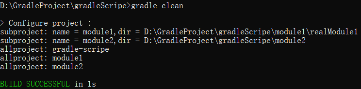
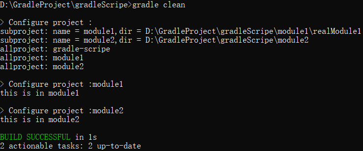
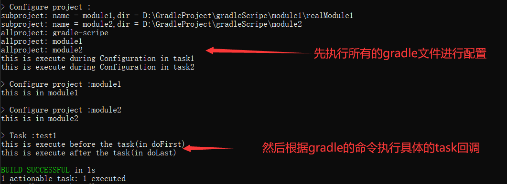
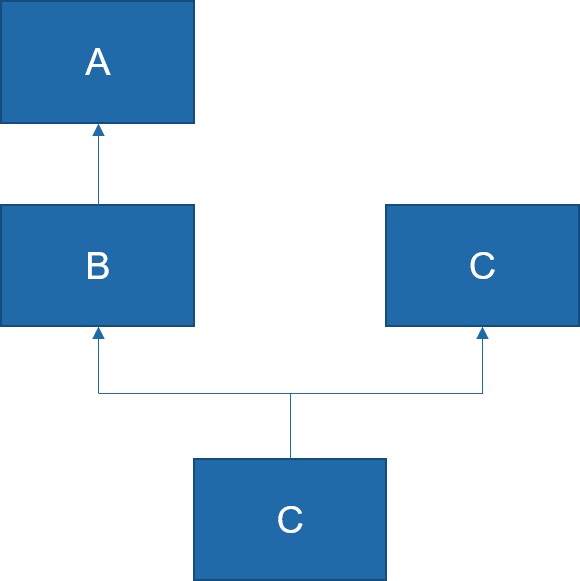
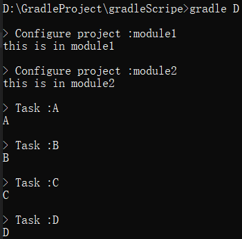
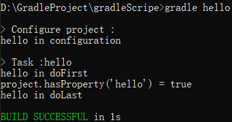

# Gradle学习笔记(3)

在铺垫`Gradle`的基础之后，本文将开始学习`Gradle`脚本的构建。主要包括`Setting`文件、`Build`文件、`Project`、`Task`等内容。

## Setting文件

`Setting`用于初始化以及工程树的配置，文件名默认为`settings.gradle`，放在根目录下。`Gradle`中的多工程通过工程树表示：一个根工程（`Android`中的`Project`）和多个子工程（`Android`中的`Module`）。子工程只有在Setting文件中进行配置后才会被`Gradle`识别。示例代码如下：

``` groovy
    rootProject.name = "gradle-scripe" //设置项目名称

    // 设置一个子工程module1（对应Android中的Module）
    include ":module1"
    //设置子工程module1对应的项目目录，可以根据需要灵活配置，目录不存在式时会报错
    project(":module1").projectDir = new File(rootDir,"module1/realModule1")

    // 设置一个子工程module2，但是没有指定它的项目目录
    // 因此会默认将同级目录下的同名目录作为项目目录
    // 例如module2的项目目录默认为./module2
    include ":module2"
```

## Build文件

每个工程下面都要有一个`build.gradle`文件（包括根工程和所有的子工程），根工程可以获取所有的子工程，因此可以在根工程的`build.gradle`文件对所有子工程进行统一配置。示例代码如下：

``` groovy
    subprojects{//对所有的子项目进行配置
        apply plugin: "java"
        repositories{
            google()
        }
        // 所有的子项目都会输出自己的项目目录
        println "subproject: name = ${project.name},dir = ${project.projectDir}"
    }

    allprojects{
        // 所有的项目（包括根项目和子项目）都会输出自己的项目名称
        println "allproject: ${project.name}"
    }

```

在执行命令`gradle clean`(目的是执行一个task去启动脚本)后，控制台输出如下：

事实上，`subprojects`和`allprojects`是对项目进行遍历，遍历的过程中调用自定义的闭包，在闭包中修改各个project的属性、配置或打印日志。此外，在两个子项目的`build.gradle`文件中添加打印代码：

``` groovy
    // 在Module1的build.gradle中直接添加
    println "this is in module1"

    // 在Module2的build.gradle中直接添加
    println "this is in module2"
```

在执行命令`gradle clean`(目的是执行一个task去启动脚本)后，控制台输出如下：

可以看出，Gradle会先执行根项目中的脚本，然后执行子项目中的脚本，即：子项目中配置的内容可以覆盖根项目的配置，如果没有覆盖，则保持根项目中的配置。

## Projects与Tasks

一个工程有多个项目组成（根项目和子项目），每个项目由多个`Task`组成。`Task`是一个原子性的操作。创建方法有两种：

``` groovy
    //本质上是调用了task方法向gradle中添加一个Task,task是Project的一个函数，原型为：create(String name,Closure configureClosure)
    task test1{
        doFirst{
            println "this is execute before the task(in doFirst)"
        }
        doLast{
            println "this is execute after the task(in doLast)"
        }
        //Gradle脚本执行时，语句从上往下执行，执行到task方法，
        // 创建名为test的Task，同时执行闭包中的代码（配置时期）
        // 注册doFirst，doLast回调，打印下面这条语句
        //然后执行gradle指定的Task,回调Task的doFirst，doLast方法
        println "this is execute during Configuration in task1"
    }
    //tasks是Project对象的属性（TaskContainer的对象），create方法是向其中添加Task对象
    tasks.create("test2") {
        doFirst{
            println "this is execute before the task2(in doFirst)"
        }
        doLast{
            println "this is execute after the task2(in doLast)"
        }
        //Gradle脚本执行时，语句从上往下执行，执行到task方法，
        // 创建名为test的Task，同时执行闭包中的代码（配置时期）
        // 注册doFirst，doLast回调，打印下面这条语句
        //然后执行gradle指定的Task,回调Task的doFirst，doLast方法
        println "this is execute during Configuration in task2"
    }
```

执行结果如图所示。

图中可以看出`Gradle`文件的执行逻辑：先把所有项目的`build.gradle`读取出来执行，然后执行具体的`Task`。`doFirst`和`doLast`是`Task`添加回调的方法。

## 任务依赖

任务之间的存在依赖，假设任务A依赖任务B，则执行任务A之前，必须先执行任务B。示例代码如下：

``` groovy
    task A{
        doLast{
            println "A"
        }
    }

    task B(dependsOn:A){
        doLast{
            println "B"
        }
    }

    task C{
        doLast{
            println "C"
        }
    }

    task D{
        dependsOn C,B//dependsOn是Task类的一个方法，可以接收多个依赖的任务作为参数
        doLast{
            println "D"
        }
    }
```

代码描述的依赖关系如下：

执行结果如下：


## 其他

`Task`在定义出来之后就是脚本文件中的一个变量，变量名就是任务名，变量类型是`Task`，可以通过`Task`的API对定义的任务进行属性修改或重新配置。示例代码如下：

``` groovy 
task hello{
    println "hello in configuration"
}
// 调用hello的doFirst方法添加回调
hello.doFirst {
    println "hello in doFirst"
    // Project在创建任务时会将该任务对应的任务名注册为Project的一个属性。
    println "project.hasProperty('hello') = ${project.hasProperty('hello')}"
}

// 调用hello的doLast方法添加回调
hello.doLast {
    println "hello in doLast"
}
```

运行结果为：


Project和Task都允许用户添加额外的自定义属性。示例代码如下：

``` groovy
// 为project添加一个属性
ext.userName = "CAM"
// 为project添加多个属性
ext{
    userAge = 15
    userGender = "Man"
}

task properTest{
    // 为task添加多个属性
    ext{
        // 优先调用内部的属性
        userName = "CAM Task"
    }
    doLast{
        println userName
        println rootProject.userName
        println userAge
    }
}
```
